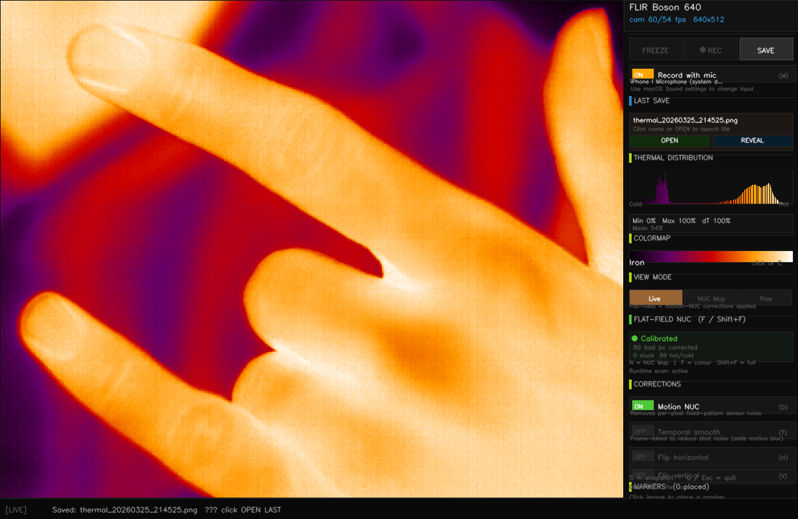

# thermal-viewer

A fast, open-source thermal camera viewer for USB UVC thermal cameras.
Clean sidebar UI, real-time noise correction, flat-field calibration, recording.

**60 fps** on supported hardware via an optional Rust extension (`thermal_core`).
Falls back to pure-Python (~55 fps) with no setup required.



Live Boson view with a clean thermal image, sidebar controls, bad-pixel handling,
recording, audio capture, and one-click access to the last saved file.

---

## Reality check

This app was vibe-coded and, so far, tested only on macOS with the FLIR Boson 640
sensor used during development.

Other cameras and platforms may work, but they are not claimed to be equally
validated yet. Camera detection, recording, audio, and UI behavior may need
small machine-specific fixes.

For the best experience, it is recommended to install and use this project
through a coding agent. That makes it easy to adapt the app to your exact
camera, OS, recorder setup, and workflow without having to manually untangle
the codebase first.

---

## Quick start

```bash
git clone https://github.com/ibmua/thermal-viewer
cd thermal-viewer
./install.sh          # macOS / Linux
# or: install.bat     # Windows

python3 thermal_viewer.py
```

> **macOS:** grant Terminal camera access in System Settings → Privacy & Security → Camera
>
> **Microphone recording:** install `ffmpeg` and grant Terminal microphone access.
>
> The packaged `thermal-viewer` console script is also installed, but on some
> systems the user scripts directory is not on `PATH` by default.

---

## Supported cameras

Auto-detected by resolution. The current heuristic list is broader than the
real validation matrix; the Boson 640 on macOS is the setup that has actually
been exercised the most.

| Camera | Resolution | FPS |
|---|---|---|
| FLIR Boson 640 | 640 x 512 | 60 |
| FLIR Boson 320 | 320 x 256 | 60 |
| FLIR Lepton 3.x (PureThermal) | 160 x 120 | 9 |
| InfiRay / Xinfrared T2S+ | 256 x 192 | 25 |
| Seek Compact | 320 x 240 | 15 |
| Any UVC thermal camera | various | 30 |

---

## Requirements

- Python 3.9+
- `opencv-python >= 4.7`
- `numpy >= 1.24`
- `ffmpeg` if you want microphone audio in the saved MP4

No extra Python dependencies are needed for video-only use. On macOS,
`install.sh` / `pip install .` also install the native audio helper packages
(`pyobjc 11.x` and `sounddevice`) used for microphone capture.
The optional Rust extension needs the Rust toolchain only if building from
source.

---

## Manual install

```bash
pip install .

# Optional: microphone audio in saved MP4 files
# macOS:   brew install ffmpeg
# Ubuntu:  sudo apt install ffmpeg
# Windows: install ffmpeg and put it on PATH

# Optional: 60fps Rust extension
# The repo currently bundles the Apple Silicon wheel locally.
pip install thermal_core/wheels/thermal_core-*-macosx_*_arm64.whl
# Other platforms can use a GitHub Release wheel if present, or build from source.

# Or build from source (requires Rust: https://rustup.rs)
pip install maturin
cd thermal_core && maturin build --release
pip install target/wheels/thermal_core-*.whl --force-reinstall
```

---

## Controls

| Key / Mouse | Action |
|---|---|
| Left-click image | Place temperature marker |
| Right-click image | Remove nearest marker |
| Sidebar buttons | Clickable — freeze, record, save |
| SPACE | Freeze / unfreeze |
| R | Start / stop recording |
| M | Toggle microphone capture for recording |
| A | Change audio input where supported |
| C | Cycle colormap (Iron / Inferno / Turbo / Jet / Hot / Gray) |
| N | Cycle view: Live / NUC Map / Raw |
| D | Toggle Motion NUC denoising |
| F | Quick colour calibration / bad-pixel refresh |
| Shift + F | Full dead-pixel re-detection |
| T | Toggle temporal smoothing |
| H / V | Flip horizontal / vertical |
| S | Save PNG snapshot |
| Q / Esc | Quit |

---

## UI

```
+-----------------------------------+--------------+
|                                   | cam/disp fps |
|     Thermal image                 | FREEZE | REC |
|                                   | SAVE         |
|                                   | LAST SAVE    |
|     Click to place markers        | distribution |
|     M1: 42%  M2: 78%              | colormap     |
|                                   | view mode    |
|                                   | flat-NUC     |
|                                   | corrections  |
|                                   | markers list |
+-----------------------------------+--------------+
|  [LIVE]  cam 60 / disp 60 fps     status msg    |
+--------------------------------------------------+
```

All controls are in the sidebar — the thermal image stays clean.

---

## Noise correction

Three stackable corrections, all toggleable in real time:

**1. Flat-field NUC** (`F`)
Point at any uniform surface, press F, hold ~2 s.
Saves per-pixel offsets + dead pixel map to `~/.thermal_viewer/flatfield_WxH.npz`.
Loaded automatically next run.

**2. Motion-gated NUC** (`D`)
Scene-based LMS — learns fixed-pattern noise from natural scene motion.
No calibration target needed.

**3. Temporal EMA smoothing** (`T`)
Exponential moving average (α = 0.35) reduces per-frame random noise.

---

## Performance

| Mode | FPS | Notes |
|---|---|---|
| Pure Python | ~55 | Default — no extra setup |
| With `thermal_core` (Rust) | **60** | PyO3 + rayon parallel pipeline |

`thermal_core` runs the entire hot-loop in parallel: gray cast → flat-field →
NUC (box-blur LMS) → normalize → Iron LUT → INTER_NEAREST upscale.
Falls back silently if not installed.

Set `PROFILE = True` in `thermal_viewer.py` for per-stage millisecond timing.

---

## Recording

Press `R` to start. Colorized `.mp4` files are saved to `~/Desktop/BosonCaptures/`.
The app records the video path and microphone path separately, then muxes them
into the final MP4 when you stop.

- Press `M` to enable / disable microphone recording before starting.
- Press `A` to cycle inputs where supported.
- `ffmpeg` must be available on `PATH` for microphone audio to end up in the final MP4.
- On macOS the app keeps the display awake while recording so the screen does
  not auto-sleep / auto-lock from idle.
- After saving, the sidebar shows a `LAST SAVE` card with clickable `OPEN` and
  `REVEAL` actions.
- If disk space gets too low for the final audio/video mux, the sidebar warns
  during recording and the final status makes it explicit that only video was saved.
- If the final audio/video mux fails, the video is still preserved and the raw
  audio sidecar is left on disk next to it for recovery.

> Large recordings need extra free disk space at stop-time, because the final
> MP4 is written as a new file during muxing.

---

## Window behavior

The app launches fullscreen by default.

---

## Building the Rust extension

```bash
curl --proto '=https' --tlsv1.2 -sSf https://sh.rustup.rs | sh   # install Rust
pip install maturin
cd thermal_core
maturin build --release
pip install target/wheels/thermal_core-*.whl --force-reinstall
```

---

## Release checklist

For release validation and publishing steps, see [RELEASE.md](/Users/sharpy/thermal-viewer/RELEASE.md).

---

## Project structure

```
thermal-viewer/
  thermal_viewer.py      main application
  fps_bare.py            FPS benchmark / diagnostic
  setup.py               packaging shim for older pip/setuptools stacks
  thermal_core/          Rust extension (PyO3 + rayon)
    src/lib.rs           hot-loop pipeline
    Cargo.toml
    wheels/              pre-built wheels
  requirements.txt
  install.sh             macOS / Linux installer
  install.bat            Windows installer
  assets/                screenshots
```

---

## Platform support

| Platform | Status | Notes |
|---|---|---|
| macOS Apple Silicon | Primary | Bundled wheel included in repo |
| macOS Intel | Supported | Source build today; release wheels can be attached to GitHub Releases |
| Linux x86_64 | Supported | Source build today; V4L2 backend |
| Windows x64 | Supported | Source build today; DirectShow backend |

---

## License

MIT — see [LICENSE](LICENSE).
